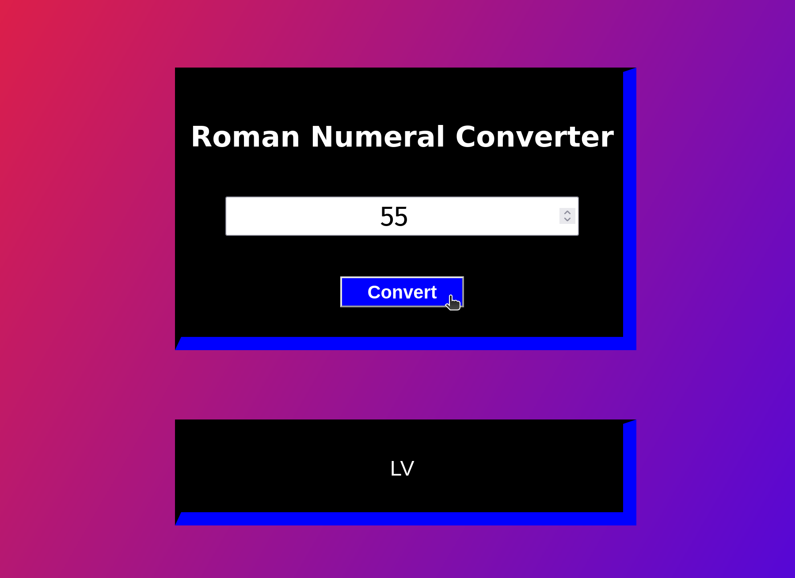

# Roman-Numeral-Converter
--This web-app was developed with the aid of HTML, CSS & JavaScript with a refreshing design.

--Its purpose is mainly to convert any given numeral under 4000 to an Roman number format.

--Responsive with Enter key to invoke the function as well as mouse cursor response.

--Responsive to invalid entries such as negatives, null or zero.

